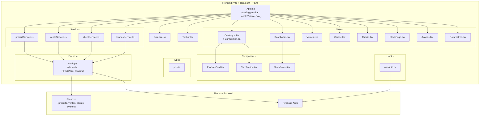
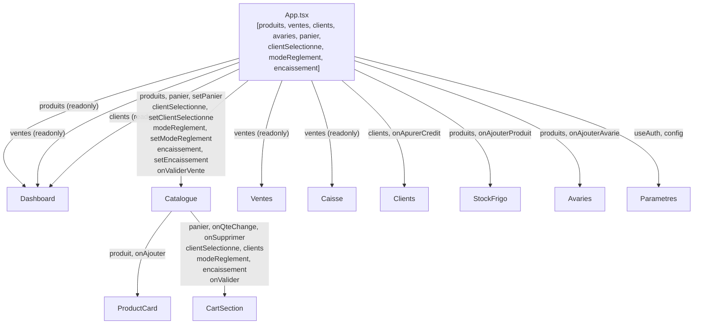
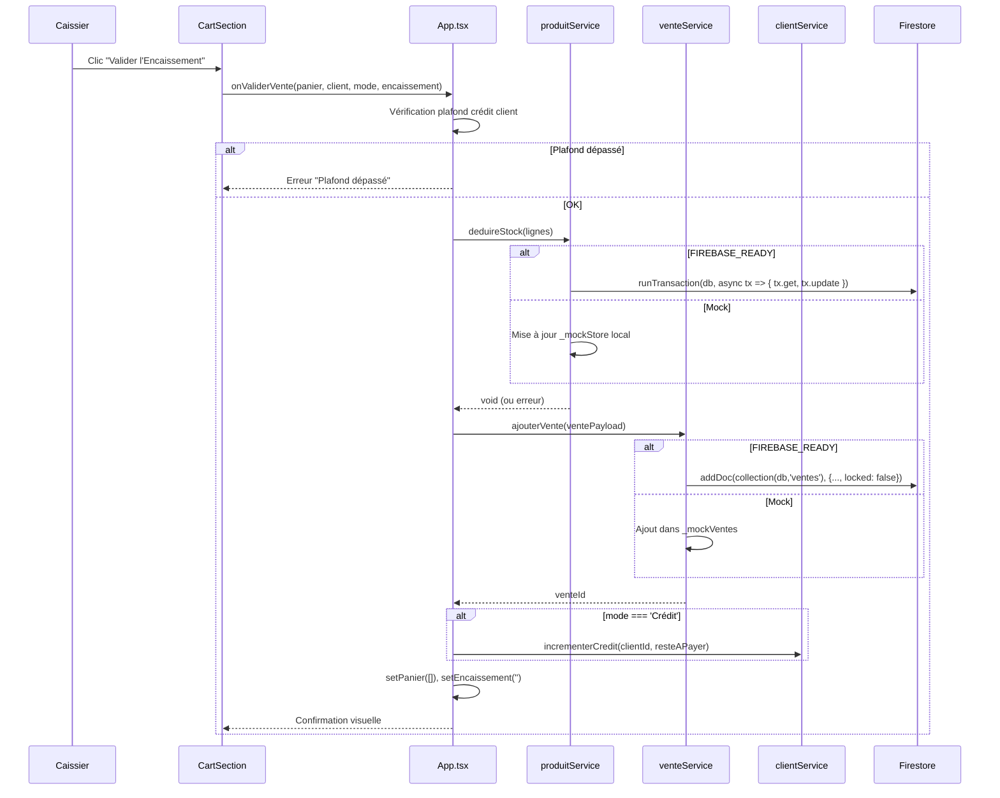
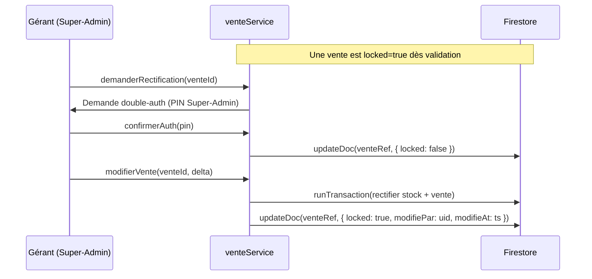
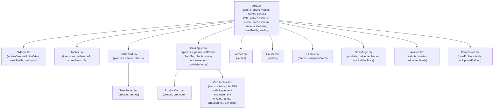
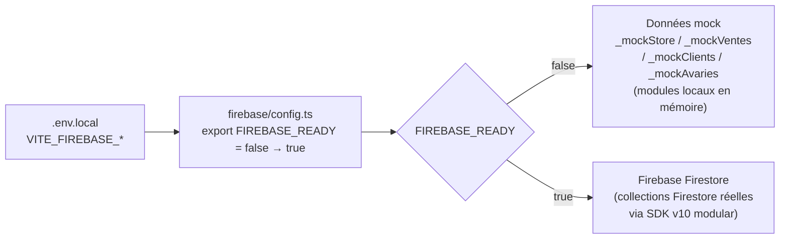

# Design Document : ERP/POS Poissonnerie Tata

## Vue d'ensemble

ERP/POS complet pour une poissonnerie, couvrant la vente au comptoir (POS tactile), la gestion du stock frigo en double unité (Cartons + Kg), le suivi des crédits clients avec plafonnement, et la clôture de caisse journalière. L'application tourne en React 19 + TypeScript (TSX) + Tailwind CSS v4 côté front, avec Firebase v10 (Firestore + Auth) comme backend, et supporte un mode "mock" local activable via le flag `FIREBASE_READY`.

---

## Architecture Haut Niveau



---

## Flux de Données — State Management



Le state global est centralisé dans `App.tsx` et descend en props vers les vues. Pas de Context API ni Redux pour ce projet — la hiérarchie est plate (1 niveau App → Vue), ce qui rend le props-drilling acceptable. Si le projet grandit, migrer `panier` + `clientSelectionne` dans un `CartContext`.

---

## Diagramme de Séquence — Validation d'une Vente



---

## Diagramme de Séquence — Verrouillage / Rectification Vente



---

## Schéma Firestore Détaillé

### Collection `produits/{id}`

```typescript
{
  nom:         string,          // "Chinchard Mauri 20"
  categorie:   string,          // "Pélagique" | "Démersal" | "Fumé"
  stockCart:   number,          // Nombre de cartons en stock
  stockKg:     number,          // Poids total en kg (stockCart * kgParCarton)
  kgParCarton: number,          // Poids moyen d'un carton (ex: 20)
  prixCart:    number,          // Prix d'un carton en GNF (ex: 450000)
  prixKg:      number,          // Prix au kg en GNF (ex: 22500)
  pampCart:    number,          // Prix d'Achat Moyen Pondéré par carton
  seuilAlerte: number,          // Seuil déclenchant le badge "⚠️ ALERTE RUPTURE"
  emoji:       string,          // Emoji d'affichage
  actif:       boolean,         // false = archivé (masqué du catalogue)
  updatedAt:   Timestamp        // serverTimestamp() à chaque écriture
}
```

**Règles Firestore** : lecture libre (auth requise), écriture réservée aux rôles `gerant` et `caissier` via Security Rules.

### Collection `ventes/{id}`

```typescript
{
  date:            Timestamp,   // serverTimestamp()
  dateStr:         string,      // "2026-06-03" (pour filtres rapides)
  clientId:        string | null,
  clientNom:       string,
  lignes: Array<{
    produitId:     string,
    produitNom:    string,
    type:          'Carton' | 'Kg',
    qte:           number,
    prixUnit:      number,      // GNF
    total:         number       // qte * prixUnit
  }>,
  totalNet:        number,      // Somme des lignes
  modeReglement:   'Espèces' | 'Virement' | 'Crédit',
  montantEncaisse: number,
  resteAPayer:     number,      // totalNet - montantEncaisse
  caissier:        string,      // uid ou displayName
  statut:          'payé' | 'crédit' | 'partiel' | 'retard',
  locked:          boolean,     // true dès validation — immuabilité
  modifiePar:      string | null,
  modifieAt:       Timestamp | null
}
```

**Index Firestore recommandés** :
- `(dateStr ASC, statut ASC)` → filtres vue Ventes
- `(clientId ASC, date DESC)` → historique client
- `(dateStr ASC, modeReglement ASC)` → caisse journalière

### Collection `clients/{id}`

```typescript
{
  nom:           string,
  telephone:     string,
  creditEnCours: number,        // GNF (dette active)
  plafondCredit: number,        // GNF (limite autorisée)
  statut:        'actif' | 'retard' | 'bloque',
  historique: Array<{           // Sous-collection alternative possible
    venteId:     string,
    date:        Timestamp,
    montant:     number,
    type:        'achat' | 'paiement'
  }>,
  createdAt:     Timestamp,
  updatedAt:     Timestamp
}
```

### Collection `avaries/{id}`

```typescript
{
  date:         Timestamp,
  dateStr:      string,
  produitId:    string,
  produitNom:   string,
  qteCart:      number,         // Cartons perdus (0 si perte en Kg)
  poidsKg:      number,         // Kg perdus
  motif:        string,         // OBLIGATOIRE — non vide
  valeurPerdue: number,         // GNF (qteCart * pampCart + poidsKg * prixKg)
  validePar:    string,         // uid du validateur
  createdAt:    Timestamp
}
```

---

## Types TypeScript Exhaustifs — `pos.ts`


```typescript
// frontend/src/types/pos.ts

// ── Entités Firestore ────────────────────────────────────────

export type ModeReglement = 'Espèces' | 'Virement' | 'Crédit'
export type StatutVente   = 'payé' | 'crédit' | 'partiel' | 'retard'
export type StatutClient  = 'actif' | 'retard' | 'bloque'
export type TypeUnite     = 'Carton' | 'Kg'
export type RoleUser      = 'gerant' | 'caissier'
export type CategoriePoisson = 'Pélagique' | 'Démersal' | 'Fumé' | string

export interface Produit {
  id:          string
  nom:         string
  categorie:   CategoriePoisson
  stockCart:   number
  stockKg:     number
  kgParCarton: number
  prixCart:    number         // GNF
  prixKg:      number         // GNF
  pampCart:    number         // Prix Achat Moyen Pondéré / carton
  seuilAlerte: number
  emoji:       string
  actif:       boolean
  updatedAt?:  Date
}

export interface LigneVente {
  produitId:  string
  produitNom: string
  type:       TypeUnite
  qte:        number
  prixUnit:   number          // GNF
  total:      number          // qte * prixUnit
}

export interface Vente {
  id:              string
  date:            Date
  dateStr:         string     // "YYYY-MM-DD"
  clientId:        string | null
  clientNom:       string
  lignes:          LigneVente[]
  totalNet:        number
  modeReglement:   ModeReglement
  montantEncaisse: number
  resteAPayer:     number
  caissier:        string
  statut:          StatutVente
  locked:          boolean
  modifiePar:      string | null
  modifieAt:       Date | null
}

export interface HistoriqueClient {
  venteId: string
  date:    Date
  montant: number
  type:    'achat' | 'paiement'
}

export interface Client {
  id:            string
  nom:           string
  telephone:     string
  creditEnCours: number       // GNF dette active
  plafondCredit: number       // GNF limite
  statut:        StatutClient
  historique:    HistoriqueClient[]
  createdAt?:    Date
  updatedAt?:    Date
}

export interface Avarie {
  id:           string
  date:         Date
  dateStr:      string
  produitId:    string
  produitNom:   string
  qteCart:      number
  poidsKg:      number
  motif:        string        // non vide — obligatoire
  valeurPerdue: number        // GNF
  validePar:    string
  createdAt?:   Date
}

export interface UserProfile {
  uid:         string
  displayName: string
  role:        RoleUser
  email:       string
}

// ── State du panier ─────────────────────────────────────────

export interface CartItem {
  produitId:  string
  nom:        string
  type:       TypeUnite
  qte:        number
  prixUnit:   number          // GNF (prixCart ou prixKg selon type)
  total:      number          // qte * prixUnit
}

// ── Props des composants ─────────────────────────────────────

export interface SidebarProps {
  activeView:    string
  setActiveView: (view: string) => void
  userProfile:   UserProfile | null
  onLogout:      () => void
}

export interface TopbarProps {
  titre:         string
  sous?:         string
  recherche?:    string
  setRecherche?: (v: string) => void
  showSearch?:   boolean
  alertCount?:   number
}

export interface ProductCardProps {
  produit:   Produit
  onAjouter: (produit: Produit, type: TypeUnite) => void
}

export interface CartSectionProps {
  items:               CartItem[]
  clients:             Client[]
  clientSelectionne:   Client | null
  setClientSelectionne:(c: Client | null) => void
  modeReglement:       ModeReglement
  setModeReglement:    (m: ModeReglement) => void
  encaissement:        string
  setEncaissement:     (v: string) => void
  onQteChange:         (produitId: string, type: TypeUnite, delta: number) => void
  onSupprimer:         (produitId: string, type: TypeUnite) => void
  onValider:           () => Promise<void>
  loading:             boolean
}

export interface StatsFooterProps {
  produits: Produit[]
  ventes:   Vente[]
}

// ── Payload service ─────────────────────────────────────────

export interface VentePayload {
  clientId:        string | null
  clientNom:       string
  lignes:          LigneVente[]
  totalNet:        number
  modeReglement:   ModeReglement
  montantEncaisse: number
  resteAPayer:     number
  caissier:        string
  statut:          StatutVente
}

export interface AvariePayload {
  produitId:    string
  produitNom:   string
  qteCart:      number
  poidsKg:      number
  motif:        string
  valeurPerdue: number
  validePar:    string
}

// ── KPI Dashboard ────────────────────────────────────────────

export interface KPIData {
  caisseJour:    number        // Espèces + Virement du jour
  nbVentesJour:  number
  margeEstimee:  number
  creditsActifs: number        // Nombre de clients en crédit/retard
  creditsMontant:number        // Somme des creditEnCours
  stockKgTotal:  number
  alertesStock:  number        // Produits sous seuilAlerte
}
```

---

## Arborescence des Composants avec Props Typées



---

## Signatures Complètes des Services

### `produitService.ts`

```typescript
import { Produit, LigneVente, AvariePayload } from '../types/pos'

// Récupère tous les produits actifs
export async function getProduits(): Promise<Produit[]>

// Récupère un produit par ID
export async function getProduitById(id: string): Promise<Produit | null>

// Ajoute un nouveau produit
export async function ajouterProduit(
  data: Omit<Produit, 'id' | 'updatedAt'>
): Promise<string>  // retourne l'id créé

// Met à jour un produit existant
export async function modifierProduit(
  id: string,
  delta: Partial<Omit<Produit, 'id'>>
): Promise<void>

// Déduction atomique du stock — cœur de la transaction
// Appelé dans handleValidateSale après ajouterVente
export async function deduireStock(lignes: LigneVente[]): Promise<void>
// Firebase: runTransaction(db, async (tx) => { pour chaque ligne: get + update atomique })
// Mock:     met à jour _mockStore local de façon synchrone

// Recalcule et met à jour le PAMP après réapprovisionnement
// PAMP_nouveau = (stock_actuel * PAMP_ancien + qte_achat * prix_achat) / (stock_actuel + qte_achat)
export async function mettreAJourPAMP(
  id: string,
  qteAchatCart: number,
  prixAchatCart: number
): Promise<void>
```

### `venteService.ts`

```typescript
import { Vente, VentePayload } from '../types/pos'

// Récupère les ventes (filtres optionnels)
export async function getVentes(opts?: {
  dateStr?: string        // filtre jour exact "YYYY-MM-DD"
  statut?:  string        // 'payé' | 'crédit' | 'retard'
  clientId?: string
  limit?:   number
}): Promise<Vente[]>

// Ajoute une vente et la verrouille immédiatement
// Retourne l'id Firestore ou l'id mock
export async function ajouterVente(payload: VentePayload): Promise<string>
// Firebase: addDoc avec locked: false, puis updateDoc locked: true (ou directement true)

// Demande de rectification — nécessite double-auth Super-Admin
export async function deverrouillerVente(
  venteId: string,
  superAdminPin: string
): Promise<boolean>   // false si pin invalide

// Rectifie une vente déverrouillée (runTransaction)
export async function rectifierVente(
  venteId: string,
  delta: Partial<Pick<Vente, 'lignes' | 'totalNet' | 'modeReglement' | 'montantEncaisse' | 'resteAPayer' | 'statut'>>,
  modifiePar: string
): Promise<void>
```

### `clientService.ts`

```typescript
import { Client, HistoriqueClient } from '../types/pos'

export async function getClients(): Promise<Client[]>

export async function getClientById(id: string): Promise<Client | null>

export async function ajouterClient(
  data: Omit<Client, 'id' | 'createdAt' | 'updatedAt' | 'historique'>
): Promise<string>

// Apurement de crédit — réduction du solde débiteur
export async function apurerCredit(
  clientId: string,
  montant: number    // GNF versé
): Promise<void>
// Postcondition: client.creditEnCours = max(0, ancien - montant)
// Met à jour statut: 'actif' si creditEnCours = 0, 'retard' si > 0.8 * plafond

// Incrémente le crédit lors d'une vente à crédit
export async function incrementerCredit(
  clientId: string,
  montant: number
): Promise<void>
// Précondition: client.creditEnCours + montant <= client.plafondCredit
// Sinon lève une Error('PLAFOND_DEPASSE')

// Met à jour le plafond crédit (gérant uniquement)
export async function modifierPlafondCredit(
  clientId: string,
  nouveauPlafond: number
): Promise<void>
```

### `avariesService.ts`

```typescript
import { Avarie, AvariePayload } from '../types/pos'

export async function getAvaries(opts?: {
  dateStr?:  string
  produitId?: string
}): Promise<Avarie[]>

// Enregistre une avarie ET déduit le stock (runTransaction)
export async function ajouterAvarie(payload: AvariePayload): Promise<string>
// Précondition: payload.motif !== '' (validé côté UI avant appel)
// Firebase:
//   runTransaction(db, async (tx) => {
//     produitRef.get → vérif stock suffisant
//     produitRef.update { stockCart: -qteCart, stockKg: -poidsKg }
//     avarieRef.set { ...payload, date: serverTimestamp() }
//   })
```

---

## Logique `runTransaction` — Déduction Stock

```typescript
// frontend/src/services/produitService.ts — version Firebase

import { runTransaction, doc, Timestamp } from 'firebase/firestore'
import { db } from '../firebase/config'
import type { LigneVente } from '../types/pos'

export async function deduireStock(lignes: LigneVente[]): Promise<void> {
  if (!db) throw new Error('Firebase non initialisé')

  await runTransaction(db, async (transaction) => {
    // Phase 1 : toutes les lectures d'abord (règle Firestore transactions)
    const refs = lignes.map(l => doc(db, 'produits', l.produitId))
    const snaps = await Promise.all(refs.map(r => transaction.get(r)))

    // Phase 2 : validation — vérification des stocks
    for (let i = 0; i < lignes.length; i++) {
      const ligne = lignes[i]
      const data  = snaps[i].data()
      if (!data) throw new Error(`Produit ${ligne.produitId} introuvable`)

      if (ligne.type === 'Carton' && data.stockCart < ligne.qte) {
        throw new Error(`Stock insuffisant pour ${ligne.produitNom} (cartons)`)
      }
      if (ligne.type === 'Kg' && data.stockKg < ligne.qte) {
        throw new Error(`Stock insuffisant pour ${ligne.produitNom} (kg)`)
      }
    }

    // Phase 3 : toutes les écritures
    for (let i = 0; i < lignes.length; i++) {
      const ligne    = lignes[i]
      const data     = snaps[i].data()!
      const newCart  = ligne.type === 'Carton' ? data.stockCart - ligne.qte : data.stockCart
      const newKg    = ligne.type === 'Kg'     ? data.stockKg   - ligne.qte : data.stockKg

      transaction.update(refs[i], {
        stockCart:  newCart,
        stockKg:    newKg,
        alerte:     newCart <= data.seuilAlerte,
        updatedAt:  Timestamp.now(),
      })
    }
  })
}
```

**Invariants de la transaction** :
- Toutes les lectures précèdent toutes les écritures (règle Firestore)
- Si une ligne échoue (stock insuffisant), la transaction entière est annulée (atomicité)
- `alerte` est recalculé automatiquement à chaque déduction

---

## Stratégie Mock → Firebase (`FIREBASE_READY` flag)



### Procédure de bascule Mock → Firebase

1. Créer le projet Firebase et activer Firestore + Authentication
2. Copier `.env.example` → `.env.local`, remplir les 6 variables `VITE_FIREBASE_*`
3. Dans `firebase/config.ts` : décommenter le bloc PRODUCTION, commenter le bloc MOCK
4. `FIREBASE_READY` devient `true` automatiquement
5. Chaque service détecte le flag et bascule sur les appels Firestore réels
6. Seeder les collections avec les données mock via un script d'import (optionnel)

### Template de service avec double chemin

```typescript
export async function getProduits(): Promise<Produit[]> {
  if (FIREBASE_READY && db) {
    const snap = await getDocs(
      query(collection(db, 'produits'), where('actif', '==', true))
    )
    return snap.docs.map(d => ({
      id: d.id,
      ...d.data(),
      updatedAt: d.data().updatedAt?.toDate(),
    } as Produit))
  }
  // Mock fallback
  return [..._mockStore]
}
```

---

## Composants — Interfaces Détaillées

### `ProductCard.tsx`

```typescript
interface ProductCardProps {
  produit:   Produit
  onAjouter: (produit: Produit, type: TypeUnite) => void
}
```

Affiche : emoji, nom, catégorie, stock (Cart + Kg), prixCart, prixKg.
Deux boutons `+` : un pour "Carton", un pour "Kg".
Badge `⚠️ ALERTE RUPTURE` si `produit.stockCart <= produit.seuilAlerte`.
Bordure rouge si critique, bordure jaune au hover sinon.

### `CartSection.tsx`

```typescript
interface CartSectionProps {
  items:               CartItem[]
  clients:             Client[]
  clientSelectionne:   Client | null
  setClientSelectionne:(c: Client | null) => void
  modeReglement:       ModeReglement
  setModeReglement:    (m: ModeReglement) => void
  encaissement:        string
  setEncaissement:     (v: string) => void
  onQteChange:         (produitId: string, type: TypeUnite, delta: number) => void
  onSupprimer:         (produitId: string, type: TypeUnite) => void
  onValider:           () => Promise<void>
  loading:             boolean
}
```

Calcule en temps réel :
- `totalNet = sum(item.qte * item.prixUnit)`
- `resteAPayer = max(0, totalNet - parseFloat(encaissement))`
- `margeDisponible = clientSelectionne ? clientSelectionne.plafondCredit - clientSelectionne.creditEnCours : Infinity`

Affiche l'alerte jaune `#ECC94B` si `modeReglement === 'Crédit'` et `resteAPayer > margeDisponible * 0.8`.
Désactive "Valider" si `modeReglement === 'Crédit'` et `resteAPayer > margeDisponible`.

### `Sidebar.tsx`

```typescript
interface SidebarProps {
  activeView:    string
  setActiveView: (view: string) => void
  userProfile:   UserProfile | null
  onLogout:      () => void
}
```

Navigation 8 items (icônes Lucide). Item actif : fond `#ECC94B`, texte `#1A365D`. Logo `logo.jpeg` en haut.

### `Topbar.tsx`

```typescript
interface TopbarProps {
  titre:         string
  sous?:         string
  recherche?:    string
  setRecherche?: (v: string) => void
  showSearch?:   boolean
  alertCount?:   number
}
```

Fond `#1A365D`. Cloche avec badge `alertCount`. Date/heure courante. Input recherche conditionnel.

---

## Logique Métier Clé dans `App.tsx`

### `handleValidateSale`

```typescript
async function handleValidateSale(): Promise<void> {
  if (panier.length === 0) return

  // 1. Calcul des totaux
  const totalNet        = panier.reduce((s, i) => s + i.total, 0)
  const montantEncaisse = parseFloat(encaissement) || 0
  const resteAPayer     = Math.max(0, totalNet - montantEncaisse)
  const statut: StatutVente = resteAPayer === 0 ? 'payé' : modeReglement === 'Crédit' ? 'crédit' : 'partiel'

  // 2. Vérification plafond crédit
  if (modeReglement === 'Crédit' && clientSelectionne) {
    const disponible = clientSelectionne.plafondCredit - clientSelectionne.creditEnCours
    if (resteAPayer > disponible) {
      setError('Plafond crédit dépassé')
      return
    }
  }

  setLoading(true)
  try {
    // 3. Construire les lignes
    const lignes: LigneVente[] = panier.map(i => ({
      produitId:  i.produitId,
      produitNom: i.nom,
      type:       i.type,
      qte:        i.qte,
      prixUnit:   i.prixUnit,
      total:      i.total,
    }))

    // 4. Déduction stock atomique (runTransaction si FIREBASE_READY)
    await deduireStock(lignes)

    // 5. Enregistrement de la vente
    await ajouterVente({
      clientId:        clientSelectionne?.id ?? null,
      clientNom:       clientSelectionne?.nom ?? 'Client anonyme',
      lignes,
      totalNet,
      modeReglement,
      montantEncaisse,
      resteAPayer,
      caissier:        userProfile?.displayName ?? 'Caissier',
      statut,
    })

    // 6. Mise à jour crédit client si vente à crédit
    if (modeReglement === 'Crédit' && clientSelectionne && resteAPayer > 0) {
      await incrementerCredit(clientSelectionne.id, resteAPayer)
    }

    // 7. Reset panier
    setPanier([])
    setEncaissement('')
    setClientSelectionne(null)

    // 8. Rechargement des données locales
    const [newProduits, newVentes, newClients] = await Promise.all([
      getProduits(), getVentes(), getClients()
    ])
    setProduits(newProduits)
    setVentes(newVentes)
    setClients(newClients)

  } catch (err) {
    setError((err as Error).message)
  } finally {
    setLoading(false)
  }
}
```

---

## Module Impression

### Reçu Thermique (80mm)

```typescript
// Déclenche window.print() avec une feuille de style @media print ciblant #receipt-80mm
function imprimerRecu(vente: Vente): void {
  // Injecter dynamiquement un <div id="receipt-80mm"> avec styles inline 80mm
  // window.print()
  // Retirer le div après impression
}
```

### Facture A4 PDF

```typescript
// Utilise la lib jsPDF ou react-pdf (à ajouter comme dépendance)
async function genererFacturePDF(vente: Vente, client: Client): Promise<void>
```

### Rapports

```typescript
// Rapport caisse journalier : ventes du jour groupées par mode
function rapportCaisseJour(ventes: Vente[], dateStr: string): CaisseReport

// Rapport analytique ventes : CA, marges, top produits
function rapportAnalytique(ventes: Vente[], produits: Produit[]): AnalytiqueReport

// Balance âgée crédits : clients en retard, montants, durées
function rapportBalanceAgee(clients: Client[], ventes: Vente[]): BalanceReport

// Inventaire frigo : stock valorisé au PAMP
function rapportInventaireFrigo(produits: Produit[]): InventaireReport
```

---

## Sécurité

### Règles Firestore (Security Rules)

```
rules_version = '2';
service cloud.firestore {
  match /databases/{database}/documents {
    function isAuth() { return request.auth != null; }
    function isGerant() { return isAuth() && get(/databases/$(database)/documents/users/$(request.auth.uid)).data.role == 'gerant'; }
    
    match /produits/{id} {
      allow read: if isAuth();
      allow write: if isAuth(); // caissier peut modifier stock
    }
    match /ventes/{id} {
      allow read: if isAuth();
      // Création libre (caissier), modification seulement si !locked ou gérant
      allow create: if isAuth();
      allow update: if isAuth() && (!resource.data.locked || isGerant());
      allow delete: if false; // jamais
    }
    match /clients/{id} {
      allow read, write: if isAuth();
    }
    match /avaries/{id} {
      allow read: if isAuth();
      allow create: if isAuth();
      allow update, delete: if isGerant();
    }
  }
}
```

### `useAuth.ts`

```typescript
export function useAuth(): {
  user:    FirebaseUser | null
  profile: UserProfile | null
  loading: boolean
  logout:  () => Promise<void>
}
// Wraps onAuthStateChanged
// Charge le profil depuis Firestore /users/{uid} après connexion
```

---

## Performance et Considérations

- **Pagination** : `getVentes()` applique `limit(50)` + pagination curseur pour les gros volumes
- **Realtime** : optionnel — `onSnapshot` sur `produits` pour alertes stock en live (à activer en phase 2)
- **PAMP** : calculé côté service, jamais côté composant — un seul appel `mettreAJourPAMP` à la réception marchandise
- **Offline** : Firestore SDK supporte le cache offline automatiquement
- **Migration JSX → TSX** : renommer `App.jsx` → `App.tsx`, `main.jsx` → `main.tsx`, ajouter `tsconfig.json` et installer `typescript` comme devDependency

---

## Dépendances à Ajouter

```json
{
  "dependencies": {
    "firebase": "^10.12.0"
  },
  "devDependencies": {
    "typescript": "^5.4.5"
  }
}
```

Optionnel pour les PDF : `jspdf` + `jspdf-autotable` ou `@react-pdf/renderer`.

---

## Correctness Properties

*Une propriété est une caractéristique ou un comportement qui doit rester vrai pour toutes les exécutions valides du système — essentiellement, un énoncé formel sur ce que le système doit faire. Les propriétés servent de pont entre les spécifications lisibles par l'humain et les garanties de correction vérifiables automatiquement.*

### Propriété 1 : Atomicité de la déduction de stock

*Pour toute* vente validée composée de N lignes, la déduction de stock de chaque produit est soit appliquée intégralement pour toutes les lignes, soit annulée pour toutes — aucune déduction partielle n'est possible.

**Valide : Exigences 4.2, 4.3, 14.1, 14.2**

### Propriété 2 : Stock non négatif

*Pour tout* produit et toute opération (vente, avarie, réapprovisionnement), `produit.stockCart >= 0` et `produit.stockKg >= 0` après l'opération — la transaction lève une erreur si la déduction demandée excède le stock disponible.

**Valide : Exigences 4.3, 9.4, 10.3**

### Propriété 3 : Plafond crédit inviolable

*Pour tout* client et toute vente à crédit, `client.creditEnCours` après la vente est inférieur ou égal à `client.plafondCredit` — toute opération dépassant ce plafond est rejetée avec l'erreur `PLAFOND_DEPASSE`.

**Valide : Exigences 3.4, 4.4, 8.6**

### Propriété 4 : Cohérence du calcul de caisse

*Pour tout* ensemble de ventes d'un jour donné, `caisseJour = sum(montantEncaisse)` pour les ventes dont `modeReglement ∈ {'Espèces', 'Virement'}` uniquement — les ventes à crédit ne contribuent jamais au solde de caisse physique.

**Valide : Exigences 1.1, 7.1, 7.4, 13.5**

### Propriété 5 : Immuabilité des ventes verrouillées

*Pour toute* vente avec `locked = true`, toute tentative de modification sans PIN Super-Admin valide est rejetée — la vente reste inchangée après un refus d'authentification.

**Valide : Exigences 6.1, 6.2, 6.4**

### Propriété 6 : Round-trip PAMP

*Pour tout* produit recevant un réapprovisionnement de quantité `q` à prix `p`, la formule `PAMP_nouveau = (stockCart * pampCart_ancien + q * p) / (stockCart + q)` produit une valeur strictement positive et supérieure ou égale au minimum de `pampCart_ancien` et `p`.

**Valide : Exigences 9.2, 9.3**

### Propriété 7 : Motif avarie obligatoire

*Pour toute* tentative d'enregistrement d'une avarie, une chaîne `motif` vide ou composée uniquement d'espaces est rejetée — aucune avarie sans motif non vide ne peut être persistée.

**Valide : Exigence 10.1**

### Propriété 8 : Totalisation du panier

*Pour tout* état du panier contenant N lignes, `totalNet = sum(item.qte * item.prixUnit)` et `resteAPayer = max(0, totalNet - montantEncaisse)` sont toujours cohérents avec les lignes présentes, recalculés à chaque modification.

**Valide : Exigences 3.1, 3.2, 3.5, 3.6**

### Propriété 9 : Cohérence du statut client

*Pour tout* client, son `statut` est déterminé de façon déterministe par `creditEnCours` et `plafondCredit` : `'actif'` si `creditEnCours = 0`, `'retard'` si `0 < creditEnCours > 0.8 * plafondCredit`, `'bloque'` si `creditEnCours >= plafondCredit`.

**Valide : Exigences 8.3, 8.4, 8.5**

### Propriété 10 : Complétude du reçu thermique

*Pour toute* vente valide, le reçu thermique généré contient au minimum : la date de la vente, toutes les lignes de la vente, le total net, le montant encaissé et le reste à payer.

**Valide : Exigence 12.1**
